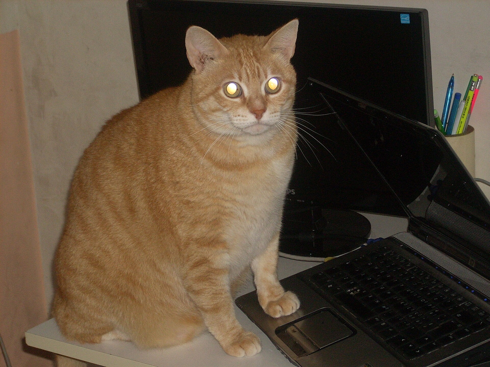
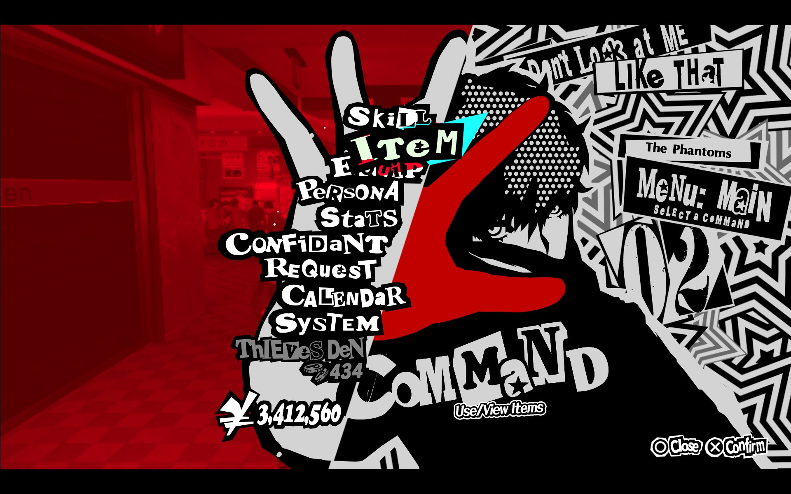
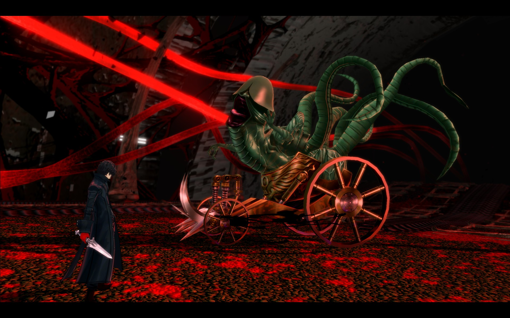

this is sample text (playground)

## Test Articles
- [playground](./[playground])
  - [playground (full theme)](./[playground-full])
  - [playground (no theme)](./[playground-gm3])
- [p3](./[playground-p3])
- [totk](./[playground-totk])

<voidcannon-theme-switcher></voidcannon-theme-switcher>

# Markdown Test Document

This document is designed to test all aspects of the pagex Markdown renderer.

To modify the test document, make changes in `/src/content/articles/playground/content.md`.

## Spoilers

Voidcannon supports ||spoiler|| syntax to hide text until the user manually reveals it.

||Spoilers will cover everything within them (i.e :p3smile:) but will not visually adapt their height to them
(due to the way they're made).||

||Spoilers can also handle wrapping content<br>which is pretty nifty||

```md
Voidcannon supports ||spoiler|| syntax to hide text until the user manually reveals it.
```

## Media Player Playground

The media player allows playback of YouTube videos.

```html
<voidcannon-media-player
    video-id="<youtube video ID>"
    video-title="Player Title"
    video-author="Player Author"
    video-thumbnail="Preview Image"
></voidcannon-media-player>
```

<voidcannon-media-player></voidcannon-media-player>
<voidcannon-media-player video-id="vz7Ju8dhe2c" video-title="Humility" video-author="Gorillaz" video-thumbnail="https://lh3.googleusercontent.com/GQLNVMQEtBm2ban-cVFaEJNg8X18EpG0YvqicbGba3PddFWziKXioFjSamuBT-bvkshV1zyY56NWbbcz=w192"></voidcannon-media-player>
<voidcannon-media-player video-id="PJ4ZnABLkSg" video-title="Get Something Out of Your Mind (feat. 荒巻勇仁)" video-author="Yaffle" video-thumbnail="https://lh3.googleusercontent.com/9Jma_0rumI18Eep_SC8P3uyfx0TX6NtgVKbFNJ8YDxu-4JKoEZjG1xnFGN8MIgHoRmLxqDTKFy6qFeg=w192"></voidcannon-media-player>
<voidcannon-media-player video-id="FFgdqhXuldQ" video-title="Blue Sky" video-author="STARKIDS" video-thumbnail="https://lh3.googleusercontent.com/bFyhsyuxSEKOD-9RFZW-IoqiJKLWO6flz-ZnPSCdqf4z9Y2i98o-W32-lDgPkty_Ed4vt0Qy9GqwLosnZw=w192"></voidcannon-media-player>
<voidcannon-media-player video-id="vRdE82xYQhU" video-title="謎" video-author="ニトロプラス キラル" video-thumbnail="https://lh3.googleusercontent.com/VwvoSg6dmP_hmU8C4NvOI6Ui9pWitZ8T6JcP9b1MEM1pd1KJpvSree_qyMuu6c6nKSgD79zFlj40SiyLuw=w192"></voidcannon-media-player>

### Same Video ID as the last entry above

<voidcannon-media-player video-id="vRdE82xYQhU" video-title="謎" video-author="ニトロプラス キラル" video-thumbnail="https://lh3.googleusercontent.com/VwvoSg6dmP_hmU8C4NvOI6Ui9pWitZ8T6JcP9b1MEM1pd1KJpvSree_qyMuu6c6nKSgD79zFlj40SiyLuw=w192"></voidcannon-media-player>

## Custom Elements

Voidcannon provides a set of custom html elements that can be used within the standard markdown html syntax.

### &lt;voidcannon-carousel&gt;

`<voidcannon-carousel>` turns any content into a carousel. Carousels are not server-rendered.

<voidcannon-carousel>
<voidcannon-slide>



</voidcannon-slide>

<voidcannon-slide>


</voidcannon-slide>
</voidcannon-carousel>

```markdown
<voidcannon-carousel>
<voidcannon-slide>


</voidcannon-slide>

<voidcannon-slide>


</voidcannon-slide>
</voidcannon-carousel>
```

> Carousels will automatically adapt their height to the largest child element.


<voidcannon-carousel>
<voidcannon-slide>



</voidcannon-slide>
<voidcannon-slide>


</voidcannon-slide>
<voidcannon-slide>



</voidcannon-slide>
<voidcannon-slide>


</voidcannon-slide>
<voidcannon-slide>


</voidcannon-slide>
</voidcannon-carousel>

### &lt;voidcannon-slide&gt;, &lt;voidcannon-harness&gt;

The `<voidcannon-slide>` and `<voidcannon-harness>` custom elements allow for slotting content.

#### &lt;voidcannon-slide&gt;

Intended for use within carousels in order to create holding containers for slides. Automatically scales images to use
up all available visual carousel space. Will probably be replaced in favor of harness some day.

```markdown
<voidcannon-slide>


</voidcannon-slide>
```

#### &lt;voidcannon-harness&gt;

Makes content take up more space horizontally in the article layout. Intended for big elements like images
or important sections that should get more highlighting or emphasis. (Carousels use this style by default without
needing a harness element)

```markdown
<voidcannon-harness>


</voidcannon-harness>
```

### &lt;voidcannon-cta&gt;

Call-to-action that emphasizes an action or acts as a callout/hint.
Can accept a button.

<voidcannon-cta layout="button">
    <md-icon slot="icon">brightness_alert</md-icon>
    Big Warning!
    <md-text-button slot="button">Go to Warner</md-text-button>
</voidcannon-cta>

```html
<voidcannon-cta layout="button">
    <md-icon slot="icon">brightness_alert</md-icon>
    Big Warning!
    <md-text-button slot="button">Go to Warner</md-text-button>
</voidcannon-cta>
```

## Other Custom Elements

The voidcannon frontend imports various other internal and external custom elements that can be server-rendered.

### @material/web

<md-filled-button>Buttons</md-filled-button>
<md-icon-button><md-icon>warning</md-icon></md-icon-button>
<md-icon>breaking_news</md-icon>

> Voidcannon ships a stripped down version of Material Symbols in production builds.
> 
> If an icon doesn't display properly in `<md-icon>` or `<wf-icon>` components, make
> sure the icon is included in `voidcannon/scripts/generate-icon-font.js`.

### gm3 (1p)

<gm3-loading-indicator></gm3-loading-indicator>
<gm3-loading-indicator contained></gm3-loading-indicator>

--- 

To get an exhaustive list, check `voidcannon/src/client/components.js`. Client-only components are under
`voidcannon/src/client/components_client.js`.

## Headings

# H1 Heading
## H2 Heading
### H3 Heading
#### H4 Heading
##### H5 Heading
###### H6 Heading

## Emphasis

*   **Bold text**
*   *Italic text*
*   ***Bold and italic text***
*   ~~Strikethrough text~~
*   <u>Underlined text</u> (if supported)

## Lists

### Unordered Lists

Unordered Lists get little Material 3 Expressive shapes as their markers.

* Item 1
* Item 2
  *   Subitem 1
  *   Subitem 2
* Item 3
* Item 4
* Item 5
* Item 6
* Item 7
* Item 8
* Item 9
* Item 10
* Item 11
* Item 12
* Item 13
* Item 14
* Item 15
* Item 16
* Item 17
* Item 18

### Ordered Lists

1.  First item
2.  Second item
    1.  Subitem 1
    2.  Subitem 2
3.  Third item

## Emojis

# 🦭
big seal

My favourite animals are the seal 🦭 and the otter 🦦. My favourite emoji is the skateboard 🛹 joycat 😹

🌈 ✨🤩💫☪🐟♏🦂🦀🦁🐍🐐🌃🍋‍🟩🍒
- 🏃🏾‍♀️‍➡️
- 👨🏻‍❤️‍👨🏻
- 🧑🏼‍❤️‍🧑🏾
- 🫩
- 🇩🇪

First-Party Custom emoji

- :p3smile: :p3worried: :p3surprised:
  - `:p3smile: :p3worried: :p3surprised:`
- :p3arrowup: :p3heart: :p3brokenheart: :p3burger: :p3camera: :p3cat: :p3dog: :p3cloud: :p3cup: :p3moon: :p3fullmoon: :p3pill: :p3rainbow: :p3snowman: :p3star: :p3sun: :p3thumbsup: :p3umbrella: :p3yen:
  - `:p3arrowup: :p3heart: :p3brokenheart: :p3burger: :p3camera: :p3cat: :p3dog: :p3cloud: :p3cup: :p3moon: :p3fullmoon: :p3pill: :p3rainbow: :p3snowman: :p3star: :p3sun: :p3thumbsup: :p3umbrella: :p3yen:`

<voidcannon-cta>
    <md-icon slot="icon">
        warning
    </md-icon>
    Check pagex_commons for details on how to add custom emoji.
</voidcannon-cta>

Supports discord-style shorthands
- :tada: (`:tada:`)
- :heart_hands::skin-tone-1: (`:heart_hands::skin-tone-1:`)
- :couple_with_heart_person_person_medium_light_skin_tone_medium_dark_skin_tone: (`:couple_with_heart_person_person_medium_light_skin_tone_medium_dark_skin_tone:`)
- :person_in_motorized_wheelchair_facing_right_medium_light_skin_tone: (`:person_in_motorized_wheelchair_facing_right_medium_light_skin_tone:`)
- :regional_indicator_b::regional_indicator_i::regional_indicator_g::regional_indicator_n::regional_indicator_u::regional_indicator_t::regional_indicator_t::regional_indicator_y:
- :flag_de: :rainbow_flag:
- :face_with_bags_under_eyes: :splatter: :root_vegetable:
- :distorted_face: :fight_cloud: :hairy_creature:

Supports discord custom emoji
- <:meowblob:1245470561296187504>
  - `<:meowblob:1245470561296187504>`
- <:catsmile:1271230456188375111>Love<:catsmile:1271230456188375111>:heart:
  - `<:catsmile:1271230456188375111>Love<:catsmile:1271230456188375111>:heart:`
- webp-only animated emoji <a:cubus:1402437389095534623>
  - `<a:cubus:1402437389095534623>`

### Task Lists

*   [ ] Unchecked task
*   [x] Checked task Checked task Checked task Checked task Checked task Checked task Checked task Checked task Checked task Checked task Checked task Checked task Checked task Checked task Checked task Checked task Checked task Checked task Checked task Checked task Checked task Checked task Checked task Checked task Checked task Checked task Checked task Checked task Checked task Checked task Checked task Checked task Checked task
*   [ ] Another unchecked task


## Links

*   [Inline link](https://www.example.com)
*   [Link with title](https://www.example.com "Example.com")
*   <https://www.example.com> (Autolink)

Voidcannon can also resolve content ID based links to their respective slugs:

```md
[Playground Article](./[playground] "Example")
```

* [Playground Article](./[playground] "Example")

## Images

The custom `<voidcannon-harness>` element can be used to render full-width sections.
Images will automatically stretch to fill the available width.

<voidcannon-harness>


</voidcannon-harness>


## Code

### Inline Code

*   `print("Hello, world!")`

### Code Blocks

```python
def greet(name):
    print(f"Hello, {name}!")

greet("World")
```

This codeblock is expandable to save on space.

```javascript
import {
    VoidcannonContentType,
    VoidcannonSectionType
} from "voidcannon";

import {PagexResourceTransformer} from "pagex";
import CollectionContentTransformer from "voidcannon/src/transformers/CollectionContent.transformer.js";

export default {
    type: VoidcannonContentType.EDITORIAL,
    id: "index",
    name: "Voidcannon Home",
    description: "Voidcannon Home",
    color: null,
    sections: [
        {
            type: VoidcannonSectionType.CAROUSEL,
            content: {
                _transform: CollectionContentTransformer.id,
                collection_id: "featured"
            },
            label: "Featured Articles",
            target: "collections/featured"
        },
        {
            type: VoidcannonSectionType.EDITORIAL,
            content: {
                _transform: PagexResourceTransformer.MARKDOWN,
                path: "./content.md"
            }
        },
        {
            type: VoidcannonSectionType.CONTENT_GRID,
            content: {
                _transform: CollectionContentTransformer.id,
                collection_id: "recent"
            },
            label: "Recent Articles"
        }
    ]
}
```

```javascript
function sayHello(name) {
    console.log("Hello, " + name + "!");
}

sayHello("World");

function foo(name) {
    console.log("Hello, " + name + "!");
}

foo("bar");
```

```
No language specified
This is a plain code block.
```

### Advanced Formatting

```javascript
// Additions and Removals

Helo// [!code --]
Helo// [!code --]
Helo// [!code --]
Hello// [!code ++]
Hello// [!code ++]
Hello// [!code ++]

// Errors and Warnings
guh()
pluh()// [!code warning]
pluhey()// [!code error]

// Highlighting
// [!code highlight:5]
dong.expand();
// This is a large highlighted section
const a = "b";
console.log("a" + a);
function b(c) {return d;}
```

```diff
diff --git a/pages/resources/integration.mdx b/pages/resources/integration.mdx
index 21d48f59..49445b53 100644
--- a/pages/resources/integration.mdx
+++ b/pages/resources/integration.mdx
@@ -110,19 +110,22 @@ Integrations represent a connection between a service and a guild. This may incl
 
 ###### GIF Media Format
 
-| Value     | Description                          |
-| --------- | ------------------------------------ |
-| mp4       | MP4 video                            |
-| tinymp4   | MP4 video in a smaller size          |
-| nanomp4   | MP4 video in a very small size       |
-| loopedmp4 | MP4 video that loops (same as `mp4`) |
-| webm      | WebM video                           |
-| tinywebm  | WebM video in a smaller size         |
-| nanowebm  | WebM video in a very small size      |
-| gif       | GIF image                            |
-| mediumgif | GIF image in a medium size           |
-| tinygif   | GIF image in a smaller size          |
-| nanogif   | GIF image in a very small size       |
+| Value     | Description                              | Description                              | Description                              |
+| --------- | ---------------------------------------- | ---------------------------------------- | ---------------------------------------- |
+| mp4       | MP4 video                                | MP4 video                                | MP4 video                                |
+| tinymp4   | MP4 video in a smaller size              | MP4 video in a smaller size              | MP4 video in a smaller size              |
+| nanomp4   | MP4 video in a very small size           | MP4 video in a very small size           | MP4 video in a very small size           |
+| loopedmp4 | MP4 video that loops (same as `mp4`)     | MP4 video that loops (same as `mp4`)     | MP4 video that loops (same as `mp4`)     |
+| webm      | WebM video                               | WebM video                               | WebM video                               |
+| tinywebm  | WebM video in a smaller size             | WebM video in a smaller size             | WebM video in a smaller size             |
+| nanowebm  | WebM video in a very small size          | WebM video in a very small size          | WebM video in a very small size          |
+| gif       | GIF image                                | GIF image                                | GIF image                                |
+| mediumgif | GIF image in a medium size               | GIF image in a medium size               | GIF image in a medium size               |
+| tinygif   | GIF image in a smaller size              | GIF image in a smaller size              | GIF image in a smaller size              |
+| nanogif   | GIF image in a very small size           | GIF image in a very small size           | GIF image in a very small size           |
+| webp      | Animated WebP image                      | Animated WebP image                      | Animated WebP image                      |
+| tinywebp  | Animated WebP image in a smaller size    | Animated WebP image in a smaller size    | Animated WebP image in a smaller size    |
+| nanowebp  | Animated WebP image in a very small size | Animated WebP image in a very small size | Animated WebP image in a very small size |
 
 ###### Example GIF
 
@@ -337,15 +340,17 @@ Returns a list of [GIF](#gif-structure) objects based on the provided query.
 
 ###### Query String Parameters
 
-| Field         | Type    | Description                                           |
-| ------------- | ------- | ----------------------------------------------------- |
-| q             | string  | The search query to use                               |
-| limit? ^1^    | integer | The maximum number of GIFs to return (20-500)         |
-| media_format? | string  | The media format to use (default `mediumgif`)         |
-| locale?       | string  | The locale to use in search results (default `en-US`) |
+| Field            | Type    | Description                                                 |
+| ---------------- | ------- | ----------------------------------------------------------- |
+| q                | string  | The search query to use                                     |
+| limit? ^1^       | integer | The maximum number of GIFs to return (20-500) (default 100) |
+| media_format ^2^ | string  | The [media format](#gif-media-format) to use                |
+| locale?          | string  | The locale to use in search results (default `en-US`)       |
 
 ^1^ The limit is only a suggestion; the API may return fewer GIFs.
 
+^2^ Invalid values default to `gif`.
+
 <RouteHeader method="GET" url="/gifs/trending" unauthenticated>
   Get Trending GIF Categories
 </RouteHeader>
@@ -354,10 +359,10 @@ Returns trending GIF categories and their associated preview GIFs.
 
 ###### Query String Parameters
 
-| Field         | Type   | Description                                           |
-| ------------- | ------ | ----------------------------------------------------- |
-| media_format? | string | The media format to use (default `mediumgif`)         |
-| locale?       | string | The locale to use in search results (default `en-US`) |
+| Field        | Type   | Description                                           |
+| ------------ | ------ | ----------------------------------------------------- |
+| media_format | string | The [media format](#gif-media-format) to use          |
+| locale?      | string | The locale to use in search results (default `en-US`) |
 
 ###### Response Body
 
@@ -406,11 +411,11 @@ Returns a list of [GIF](#gif-structure) objects that are currently trending.
 
 ###### Query String Parameters
 
-| Field         | Type    | Description                                           |
-| ------------- | ------- | ----------------------------------------------------- |
-| limit? ^1^    | integer | The maximum number of GIFs to return (20-500)         |
-| media_format? | string  | The media format to use (default `mediumgif`)         |
-| locale?       | string  | The locale to use in search results (default `en-US`) |
+| Field        | Type    | Description                                           |
+| ------------ | ------- | ----------------------------------------------------- |
+| limit? ^1^   | integer | The maximum number of GIFs to return (20-500)         |
+| media_format | string  | The [media format](#gif-media-format) to use          |
+| locale?      | string  | The locale to use in search results (default `en-US`) |
 
 ^1^ The limit is only a suggestion; the API may return fewer GIFs.
 

```

```protobuf
syntax = "proto3";

package bignutty.pagex;

// Represents preprocessed metadata for pagex media items.
message PagexProcessedMedia {
  // The version of this metadata payload.
  int32 version = 1;
  // Preprocessed LQIP value for this media item.
  int32 lqip = 2;
  // Attributions
  repeated PagexMediaAttribution attributions = 3;
}

// An attribution (copyright, source) for a media item.
message PagexMediaAttribution {
  // Text label (i.e Copyright 2025 bignutty).
  string label = 1;
  // URL linking to the original source or author.
  optional string url = 2;
}
```

```protobuf
syntax = 'proto3';

package fm.last.api;

import "bignutty/api/JsField.proto";

import "fm/last/api/common.proto";

// Last.fm `track` service.
service TrackService {
  // track.getInfo
  // Returns information about a track.
  rpc getInfo(TrackInfoRequest) returns (TrackInfoResponse);
}

// Query parameters for a track.getInfo request.
message TrackInfoRequest {
  // Track name (required, unless mbid is provided).
  optional string track = 1;
  // Artist name (required, unless mbid is provided).
  optional string artist = 2;
  // MusicBrainz Recording ID.
  optional string mbid = 3;

  // User to retrieve stats for
  optional string username = 4;

  // Autocorrect tracks via corrections.
  optional bool autocorrect = 5;
}

// A track as returned by the track.getInfo method.
message TrackInfoResponse {
  // An artist fragment in track.getInfo responses.
  message PartialArtist {
    // Canonical name of the artist.
    string name = 1;
    // Last.fm URL for the artist.
    string url = 2;
    // MusicBrainz ID for the artist.
    optional string mbid = 3;
  }

  // An album fragment in track.getInfo responses.
  message PartialAlbum {
    // Canonical title of the album.
    string title = 1;
    // Canonical name of the album artist.
    string artist = 2;
    // Last.fm URL for the album.
    string url = 3;
    // Cover artwork for the album.
    repeated fm.last.api.Image image = 4;
  }

  // Metadata about Last.fm site streaming.
  message StreamingMetadata {
    // Whether the track can be streamed.
    bool streamable = 1 [(bignutty.api.js_field) = "#text"];
    // Whether the full track is available for streaming.
    bool fulltrack = 2;
  }

  // Top Tags fragment in track.getInfo responses.
  message TopTags {
    // Tag fragment.
    message PartialTag {
      // Tag Name
      string name = 1;
      // Last.fm URL for the tag.
      string url = 2;
    }

    // List of top tags. (max. 5)
    repeated PartialTag tag = 1;
  }

  // Canonical name of the track.
  string name = 1;
  // Last.fm URL.
  string url = 2;
  // Duration of the track.
  // Will be "0" when the duration is unknown.
  int32 duration = 3;

  // Global listener count.
  int32 listeners = 4;
  // Global scrobble count.
  int32 playcount = 5;

  // Amount of scrobbles the user has for this track.
  optional int32 userplaycount = 6 [(fm.last.api.requires_user)=true];
  // Whether the user has loved the track.
  optional bool userloved = 7 [(fm.last.api.requires_user)=true];

  // Artist associated with the track.
  PartialArtist artist = 10;
  // Canonical album this track is featured on.
  optional PartialAlbum album = 11;

  // If the track can be streamed on last.fm.
  StreamingMetadata streamable = 20 [deprecated=true];
  // Top tags added by users.
  TopTags toptags = 21;
  // Wiki entry written by users.
  optional fm.last.api.Wiki wiki = 22;
}
```

## Horizontal Rule

---

## Blockquotes

> This is a blockquote.
> It can span multiple lines.
> > And even be nested.

## Tables

| Header 1 | Header 2 | Header 3 | Header 3 | Header 3 | Header 3 | Header 3 | Header 3 | Header 3 | Header 3 | Header 3 | Header 3 | Header 3 | Header 3 | Header 3 |
| -------- | -------- | -------- | -------- | -------- | -------- | -------- | -------- | -------- | -------- | -------- | -------- | -------- | -------- | -------- |
| Cell 1   | Cell 2   | Cell 3   | Cell 3   | Cell 3   | Cell 3   | Cell 3   | Cell 3   | Cell 3   | Cell 3   | Cell 3   | Cell 3   | Cell 3   | Cell 3   | Cell 3   |
| Cell 4   | Cell 5   | Cell 6   | Cell 6   | Cell 6   | Cell 6   | Cell 6   | Cell 6   | Cell 6   | Cell 6   | Cell 6   | Cell 6   | Cell 6   | Cell 6   | Cell 6   |

| Field                         | Type                                                                                               | Description                                                                                                                               |
|-------------------------------|----------------------------------------------------------------------------------------------------|-------------------------------------------------------------------------------------------------------------------------------------------|
| id                            | snowflake                                                                                          | The ID of the message                                                                                                                     |
| channel_id                    | snowflake                                                                                          | The ID of the channel the message was sent in                                                                                             |
| lobby_id?                     | snowflake                                                                                          | The ID of the lobby the message was sent in                                                                                               |
| author ^1^                    | partial [user](/resources/user#user-object) object                                                 | The author of the message                                                                                                                 |
| content ^2^                   | string                                                                                             | Contents of the message                                                                                                                   |
| timestamp                     | ISO8601 timestamp                                                                                  | When this message was sent                                                                                                                |
| edited_timestamp              | ?ISO8601 timestamp                                                                                 | When this message was last edited                                                                                                         |
| tts                           | boolean                                                                                            | Whether this message will be read out by TTS                                                                                              |
| mention_everyone              | boolean                                                                                            | Whether this message mentions everyone                                                                                                    |
| mentions                      | array[partial [user](/resources/user#user-object) object]                                          | Users specifically mentioned in the message                                                                                               |
| mention_roles                 | array[snowflake]                                                                                   | Roles specifically mentioned in this message                                                                                              |
| mention_channels? ^3^         | array[partial [channel](/resources/channel#channel-object) object]                                 | Channels specifically mentioned in this message                                                                                           |
| attachments ^2^               | array[[attachment](#attachment-object) object]                                                     | The attached files                                                                                                                        |
| embeds ^2^                    | array[[embed](#embed-object) object]                                                               | Content embedded in the message                                                                                                           |
| reactions?                    | array[[reaction](#reaction-object) object]                                                         | Reactions on the message                                                                                                                  |
| nonce?                        | integer \| string                                                                                  | The message's nonce, used for message deduplication                                                                                       |
| pinned                        | boolean                                                                                            | Whether this message is pinned                                                                                                            |
| webhook_id?                   | snowflake                                                                                          | The ID of the webhook that send the message                                                                                               |
| type                          | integer                                                                                            | The [type of message](#message-type)                                                                                                      |
| activity?                     | [message activity](#message-activity-object) object                                                | The rich presence activity the author is inviting users to                                                                                |
| application?                  | [integration application](/resources/integration#integration-application-object) object            | The application of the message's rich presence activity                                                                                   |
| application_id?               | snowflake                                                                                          | The ID of the application; only sent for interaction responses and messages created through OAuth2                                        |
| flags                         | integer                                                                                            | The [message's flags](#message-flags)                                                                                                     |
| message_reference? ^4^        | [message reference](#message-reference-object) object                                              | The source of a crosspost, snapshot, channel follow add, pin, or reply message                                                            |
| referenced_message? ^5^ ^4^   | ?[message object](#message-object)                                                                 | The message associated with the `message_reference`                                                                                       |
| message_snapshots? ^4^        | array[[message snapshot](#message-snapshot-object) object]                                         | The partial message snapshot associated with the `message_reference`                                                                      |
| call?                         | [message call](#message-call-object) object                                                        | The private channel call that prompted this message                                                                                       |
| interaction? **(deprecated)** | [message interaction](/interactions/receiving-and-responding#message-interaction-structure) object | The interaction the message is responding to                                                                                              |
| interaction_metadata?         | [message interaction metadata](#message-interaction-metadata-object) object                        | The interaction the message originated from                                                                                               |
| resolved?                     | [resolved data](/interactions/receiving-and-responding#resolved-data-structure) object             | Data for users, members, channels, and roles referenced in this message                                                                   |
| thread?                       | [channel](/resources/channel#channel-object) object                                                | The thread that was started from this message, with the [`member`](/resources/channel#channel-object) key representing thread member data |
| role_subscription_data?       | [message role subscription](#message-role-subscription-object) object                              | The role subscription purchase or renewal that prompted this message                                                                      |
| purchase_notification?        | [message purchase notification](#message-purchase-notification-object) object                      | The guild purchase that prompted this message                                                                                             |
| gift_info?                    | [message gift info](#message-gift-info-object) object                                              | Information on the gift that prompted this message                                                                                        |
| components ^2^                | array[[message component](/resources/components#component-object) object]                          | The message's components (e.g. buttons, select menus)                                                                                     |
| sticker_items?                | array[[sticker item](/resources/sticker#sticker-item-object) object]                               | The message's sticker items                                                                                                               |
| stickers?                     | array[[sticker](/resources/sticker#sticker-object) object]                                         | Extra rich information for the message's sticker items; only available in some contexts                                                   |
| poll? ^2^                     | [poll](#poll-object) object                                                                        | A poll!                                                                                                                                   |
| changelog_id?                 | snowflake                                                                                          | The ID of the changelog that prompted this message                                                                                        |
| soundboard_sounds?            | array[[soundboard sound](/resources/soundboard/#soundboard-sound-object) object]                   | The message's soundboard sounds                                                                                                           |
| potions?                      | array[[potion](#potion-object) object]                                                             | Potions applied to the message                                                                                                            |
| shared_client_theme?          | [shared client theme](#shared-client-theme-object) object                                          | The shared client theme                                                                                                                   |

## HTML

<p>This is some HTML text.</p>
<div>
  <button>This is a button.</button>
</div>

```html
<p>This is some HTML text.</p>
<div>
  <button>This is a button.</button>
</div>
```

HTML in markdown can also include templates that get server-rendered.

<voidcannon-cta layout="button" style="margin-top: 1em;">
    <md-icon slot="icon">convert_to_text</md-icon>
    this is a cta rendered from a markdown document
    <md-filled-button slot="button">pluh</md-filled-button>
</voidcannon-cta>
<br>
<hr>

```html
<voidcannon-cta layout="button" style="margin-top: 1em;">
    <md-icon slot="icon">convert_to_text</md-icon>
    this is a cta rendered from a markdown document
    <md-filled-button slot="button">pluh</md-filled-button>
</voidcannon-cta>
<br>
<hr>
```

## Line Breaks

This is a line.<br>
This is another line.

## Escaping

\* \* \* \* \*

## Special Characters

` ~ ! @ # $ % ^ & * ( ) - _ = + [ ] { } | ; : ' " , . / < > ?