<voidcannon-cta>
    <md-icon slot="icon">preview</md-icon>
    Later parts of this post will contain spoilers for the story, ending, and specific gameplay sections.
</voidcannon-cta>

## Starting with what's best

The game looks gorgeous and runs flawlessly. Even on my hardware.

<voidcannon-carousel>
<voidcannon-slide>

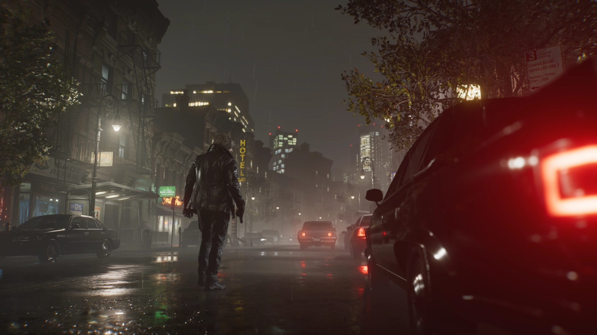

</voidcannon-slide>

<voidcannon-slide>

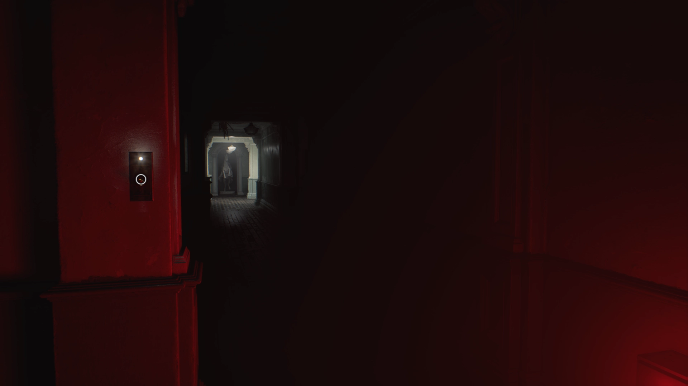

</voidcannon-slide>

<voidcannon-slide>

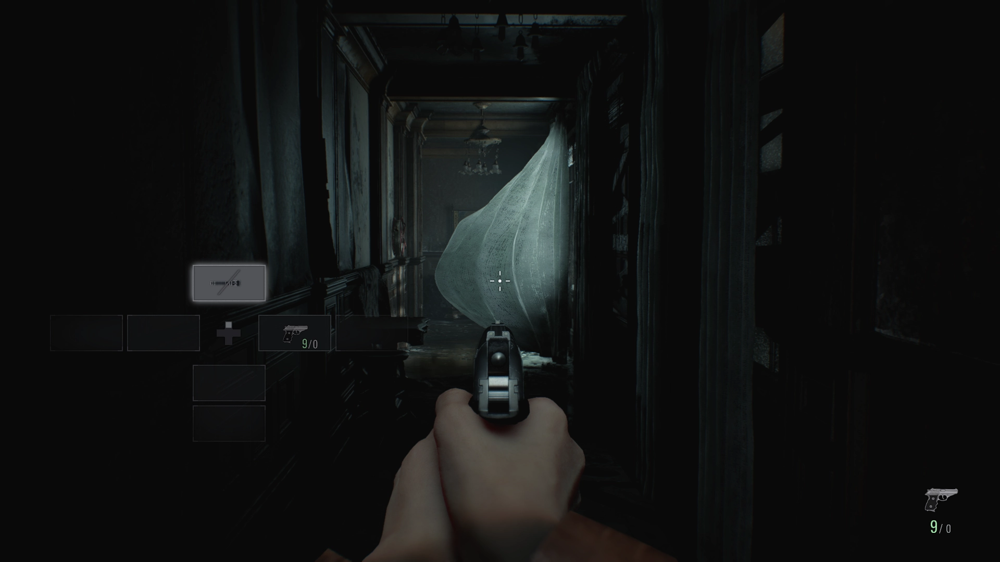

</voidcannon-slide>

<voidcannon-slide>

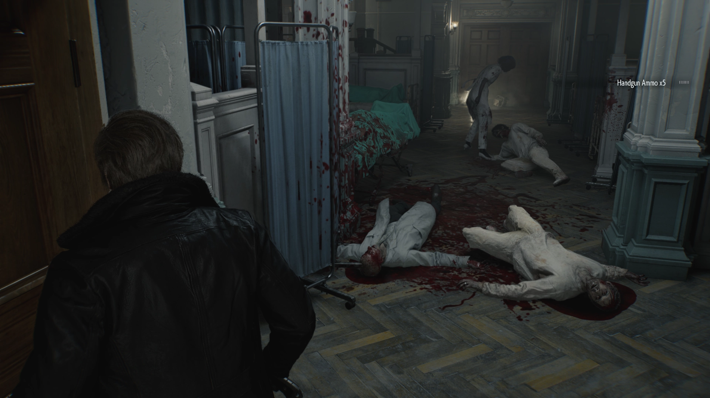

</voidcannon-slide>
</voidcannon-carousel>

My graphics card (Radeon RX 5500 XT) is the lowest one listed under the "minimum requirements," I'm running on 8 GB of
RAM, and my CPU is probably below what they recommend. The game still looks great, even on low (not lowest!) settings.

Admittedly, frame generation was necessary to keep the game at or above 60 FPS throughout the entire experience. This
resulted in occasional Vsync issues, but it didn't degrade the experience for me. The RE Engine continues to be the
prime example of what a modern game engine *can* be if developers actually care. The game does a great job of utilizing
its lighting to draw attention to what matters, or simply to create mesmerizing set pieces.

The attention to detail and care really shines throughout the various environments you visit. Each and every material
looks real, every area has small props lying around, but never to the point where it feels artificial. Something new in
this game are the dynamic blood splatter decals that can get applied to the environment after an encounter. Some of
these even manage to stick around for quite some time, which is nice when you play larger sections in one sitting.

<voidcannon-carousel>
<voidcannon-slide>

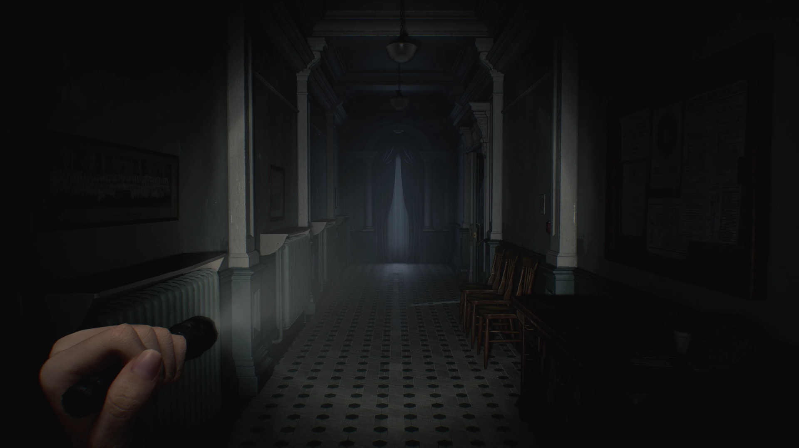

</voidcannon-slide>
<voidcannon-slide>

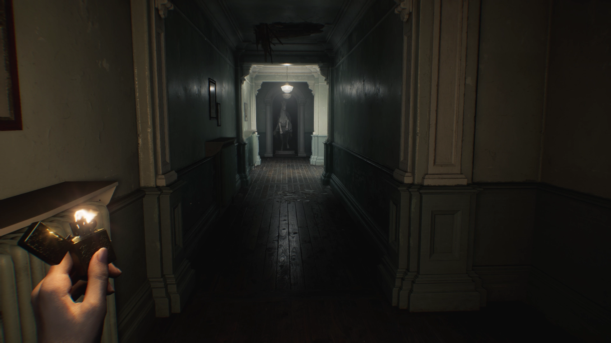

</voidcannon-slide>
<voidcannon-slide>

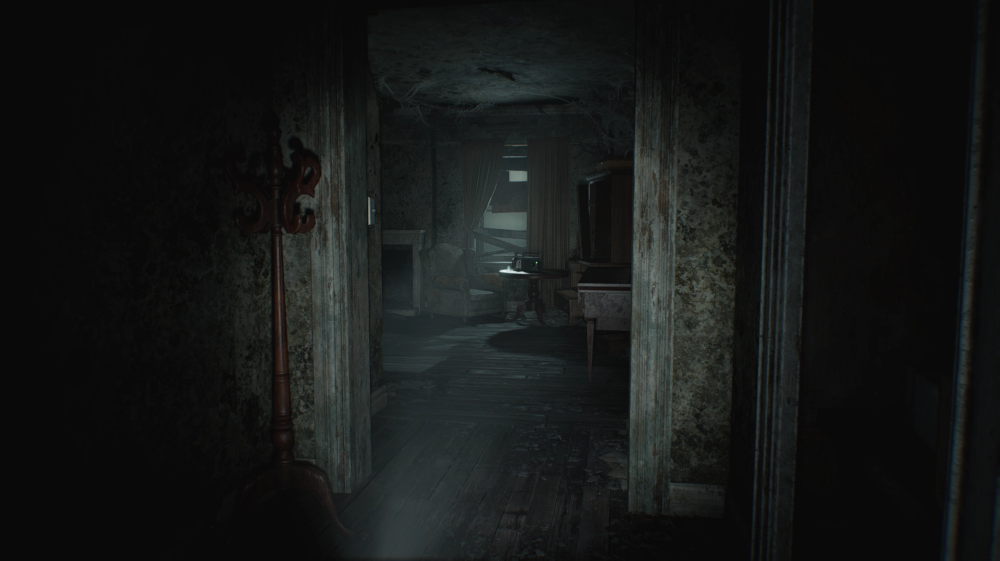

</voidcannon-slide>
<voidcannon-slide>

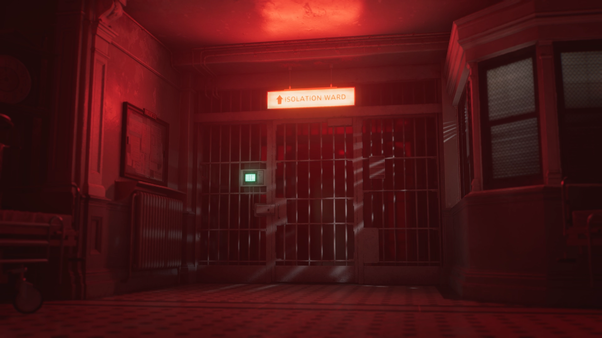

</voidcannon-slide>
<voidcannon-slide>

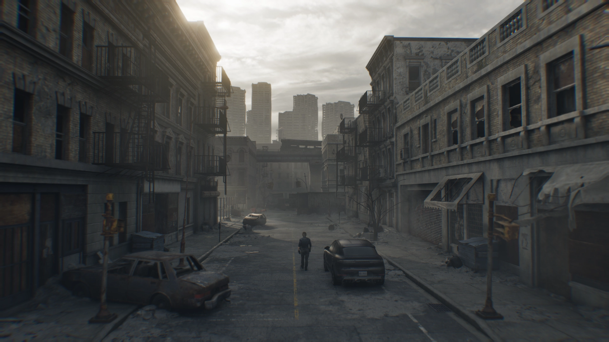

</voidcannon-slide>
<voidcannon-slide>

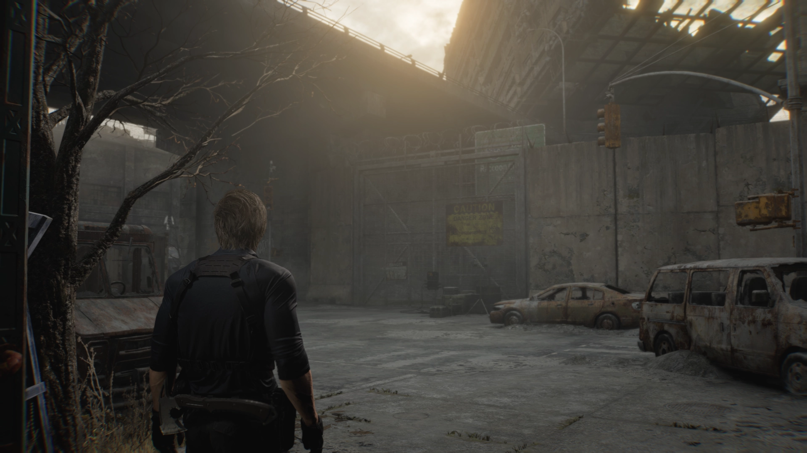

</voidcannon-slide>
</voidcannon-carousel>

My only critique regarding visuals would be that the Raccoon City half of the game could use a little more color. It
gets a bit repetitive to spend four hours running through gray and beige buildings.

## Grace gets real

I believe that Grace feels unlike any other character I've played in a Resident Evil game before. She reacts the way
you'd expect someone to react given the situation. She's not combat-trained; she's an office worker thrown into the most
horrifying scenario imaginable. The previous two games, Resident Evil 7 and Resident Evil Village, were held back in
their horror by having a walking quip machine, Ethan Winters, who could not be fazed by anything. That man could lose
every last limb on his body and still have a "Fuck you" left for whoever was responsible.

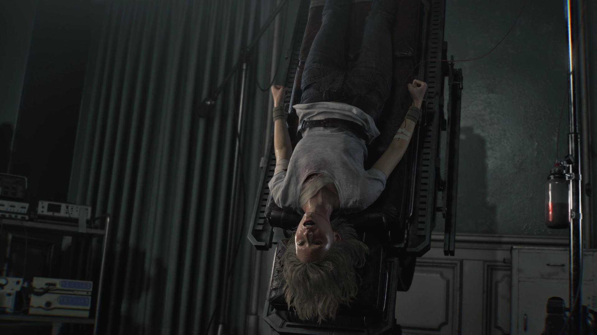

This is also reflected in her gameplay sections; the area design and item placements are meant to keep the tension high
while offering stealth as a preferred option. This does work for the opening hours of the game, but by the end of her
hospital section, I had around 40 spare bullets and more health items than I could count, despite killing every enemy
in my way.

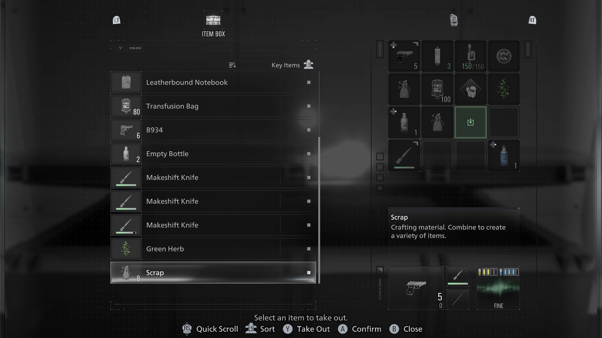

One unfortunate aspect of Grace's campaign is the complete lack of boss fights. Her gameplay includes one section that
could be considered a boss encounter, except you don't actually fight anything (more on that later). I suppose the
intention was to keep her underpowered throughout the entire experience, but I still would have preferred having to
actually fight back for once.

## Leon gets unreal

Leon's gameplay is essentially the Resident Evil 4 remake on crack.

I actually ended up having the complete opposite problem to Grace's campaign by the end: I had an inventory full of
crafting supplies, while health remained a scarce resource. A look at my inventory right before heading to the final
boss pretty much says everything (click to reveal):

||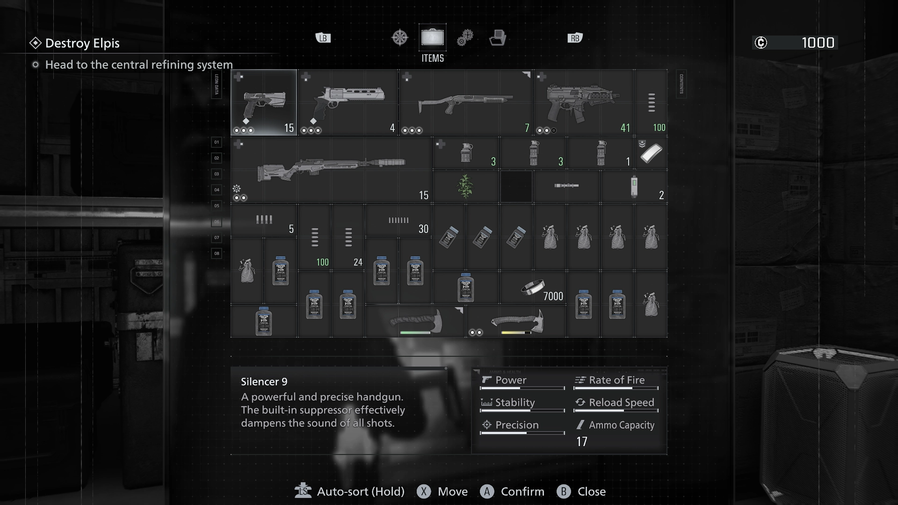||

Even though the available selection of guns is almost identical to the Resident Evil 4 remake, I found that the enemy
variety made the pistol and rifle the right answers most of the time. I rarely used grenades, as the environments seldom
presented good opportunities for them. The few sections that did ended up so hectic that I'd grab my trusty shotgun
instead of trying to line everyone up for a grenade strike.

I was also pretty consistently low on credits for the supply crate, despite my continued strategy of killing anything
that moves. It is a little unfortunate that, at least during the campaign, you only get access to one alternative
pistol.

## All together now!

I had a great time with the dual-protagonist campaign. Especially in the first large section of the game, being able to
experience the same area from two play styles is a lot of fun.

I do wish they had balanced the lengths of each section better. The "meat" of the game is one large section where you
play as Grace for two to three hours, and another where you play as Leon for three to four hours. At the beginning and
end of these, the game quickly cuts between the two perspectives to show you what was happening "in the meantime" or
somewhere else.

This works from a storytelling perspective, but it results in neither gameplay style really being able to shine outside
its "dedicated" large section. Some of the changes last for maybe 10 minutes before switching back to the character
you were playing as previously. I'd love to see more of this style of gameplay in the future, though (maybe even a
proper Resident Evil 6 reimagining that combines the best parts into one cohesive campaign).

<voidcannon-cta type="primary">
    <md-icon slot="icon">preview</md-icon>
    From here on out I'll focus on the story and specific sections of gameplay. If you haven't played the game I'd recommend you stop reading.
</voidcannon-cta>

## Game Design (0/3)

One major gripe I have with the game is the overreliance on "do/get three things."

During my playthrough, I can remember encountering all of these:

- Collect three quartz blocks
- Obtain three security clearances
- Get three substances to analyze (Crafting Recipes)
- Find and open three safes
- Gather three spark plugs
- Turn on three generators
- Find three detonator parts
- Find and open ~~four~~ three containers (One was already open)

No matter what our protagonist(s) have to do, it's three or nothing. There are a few exceptions where an item has two (

2) uses or you have to do two things, but most of your playtime is spent watching (0/3) turn into ~~(3/3)~~.

Three is a nice middle ground between "this could have just been a linear section" and "this is too much, I'm getting
tired," but once everything relies on the rule of three, it starts to feel repetitive and artificial.

In addition to everything requiring you to do three of something, the game also heavily suffers from "Resident Evil
logic", meaning the protagonists often act unreasonably given the situation. The most egregious example of this is the
third Puzzle Box, which is lacking its Sun, Moon, and Star icons. Every other puzzle box in the hospital, two of which
we have already encountered and solved, has Braille text above or on all the buttons. However, for Plot Reasons, we have
to go get Emily to decipher them. I don't have high demands for the logic behind puzzles, but they really could have
tried to find another reason to bring Emily here instead of making Grace inexplicably incapable of solving the puzzle
box through trial and error.

One variant I was able to come up with would've been hiding the solution to the puzzle box in a longer piece of text in
Braille, perhaps even across several documents. That would still require Grace to go get help from Emily, after which
she obviously couldn't leave her alone in the now-open cell.

## Linear excitement during the latter half

This is an issue that all the recent Resident Evil titles have had: the game gets way more linear the further you
progress.

They did a great job of balancing open-exploration sections and linear progression with short, fun sections to blow off
steam in between.

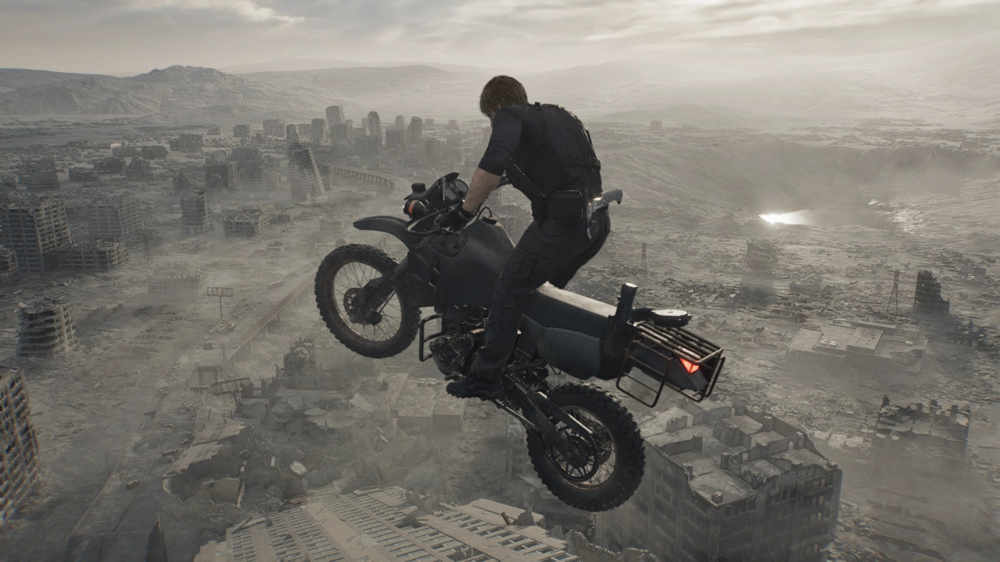

However, the RPD, and everything after it for that matter, marks a turning point. Playing these sections felt like the
game tried to show me a lot of cool things while also running out of time.

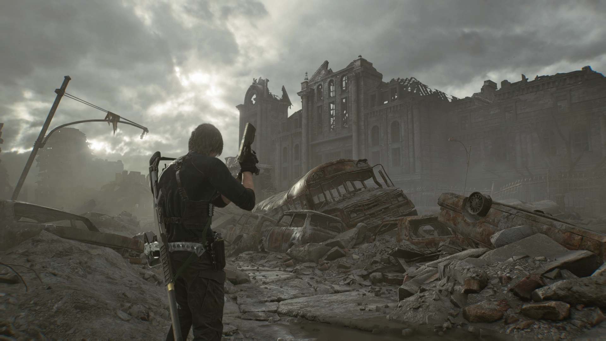

The RPD itself consists of the following steps:

1. Get to the Library to pick up a key item
2. Use the key item to open up a door
3. Watch a cutscene and play a short stealth section
4. Run away
5. Leave the RPD

There are two additional things you can do: a short scavenger hunt and unlocking a briefcase. I believe the area has two
other enemies you can defeat for some credits. That's it.

I love the idea of revisiting old locations like this, but it feels like a wasted opportunity to have you spend barely
20 minutes in the area, only to leave and fight two boss fights basically back-to-back. The fact that they brought back
Mr. X might at first seem like a really cool twist; that is, until you realize he's in the game for 10 minutes tops. 20
if you spend more time looking around. It doesn't help that not even 20 minutes later, you immediately run into the next
boss encounter that feels like another "look who we brought back :pointpeak:" moment. I think there were a lot of cool
ideas that could have been executed by revisiting Raccoon City, but the way Requiem handles it feels like a wasted
opportunity.

I suppose this is what I get for asking to have fewer "do three things" moments. 🥴

The sections post-RPD struggle the most with their pacing. I'm not sure if the game developers had a self-imposed time
limit for how long the game should play, or if they had too many last minute ideas. The final two to three hours of the
game boil down to you being rushed from set piece to set piece, with very little to no downtime.

## Last but not least: The Plot

The story is, again, typical for a Resident Evil game. It starts out with an intriguing premise, then completely loses
the plot in its final hours.

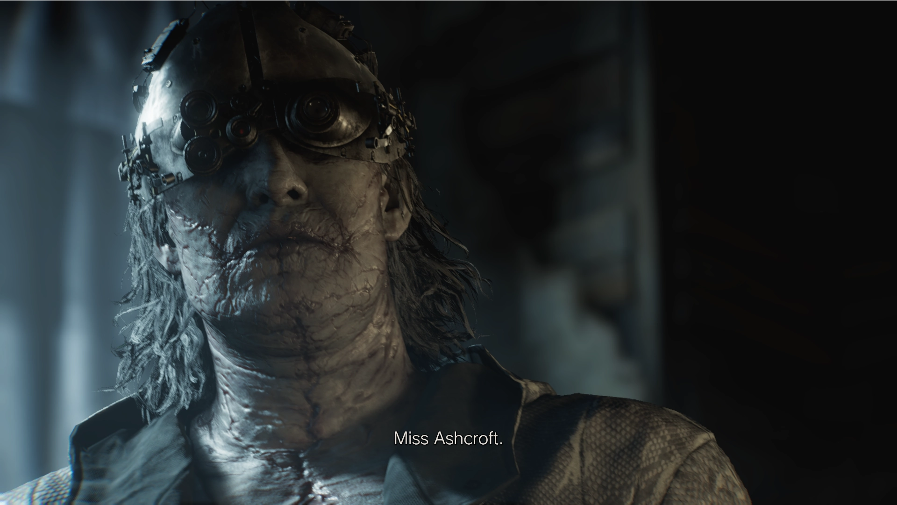

Victor Gideon makes for an interesting antagonist. He's seemingly spent years tracking Grace down, planning, and
researching the events that will transpire throughout the game. Unfortunately, Gideon just... doesn't do a lot
throughout the campaign.

- He kidnaps Grace and subdues Leon, but doesn't do anything of note to either of them.
- He lets both of them escape from the hospital, only to conveniently pick Grace back up (I don't even want to get into
  how weird the motivation for Grace post-hospital is).
- He's flown out to Raccoon City with The True Antagonist and Grace?
- ???
- 🏍🏍🏍🏍
- ???
- Shows up to be the final boss
- Dies

I can see a lot of potential given the character and setup, but the game seems content with keeping Gideon as a prop
that it can conveniently dispose of in the end.

The same thing goes for The True Antagonist, Zalbert Zesker, who the game insists on calling Zeno or just Z.

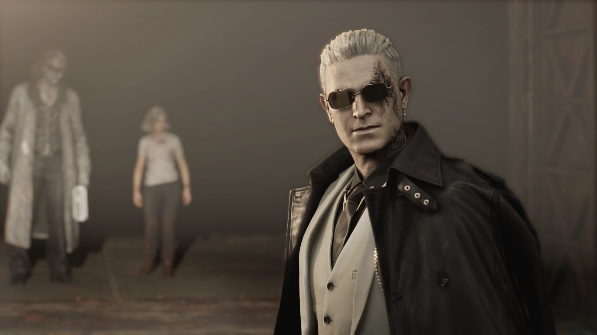

His entire role in the game is to be the one who supposedly funded this entire operation. He gets one evil monologue at
the end and then gets killed off. The plot would progress nearly identically to how it does in the final game if he
wasn't here or wasn't Wesker. Gideon, being an ex-Umbrella researcher, at least has some sort of character motivation to
continue his mission.

The only aspect of the story I genuinely disliked was when Leon S. Kennedy starts shooting at human soldiers who storm
two rooms in a secret facility, only for them to never show up again. Especially when you consider that the second,
larger room can be taken out by releasing a Licker from its tube with a well-placed shot. The weirdest part was that
their presence in the game is once again no longer than 10 minutes at most. The only story reason I could come up with
is that they flew in with Gideon and Wesker on the helicopter, and that's why we only ever run into two teams? It makes
for an awkward moment in an otherwise great finale.

All of this is not meant to imply that I disliked the story. I had a great time going in blind and experiencing the
narrative for the first time. This is meant to be taken as a "what could have been," not "look how they
butchered my boy."

## Requiem.

All in all, Resident Evil Requiem is an amazing game. The plot might have holes and the gameplay can feel a little samey
at times, but the overall experience was never boring. Quite the opposite, actually. I felt that throughout most of my
journey, the gameplay was packed so tightly that twenty minutes felt like an hour. Not because it dragged on for too
long, but because I couldn't wrap my mind around all the things happening back-to-back.

I **really** hope that RE9 ends up getting a Mercenaries mode; the gameplay as Leon is more refined than ever before and
is
a joy to play. The few sections where they funnel zombies in and just let you do your thing with a giant stockpile of
ammunition or heavy weaponry are where the gameplay really shines.

This game also had the objectively worst and most terrifying objective notification I have received in a long time. (
Yes, I instinctively threw a grenade).

> **Arachnophobia warning** for those who are sensitive to creepy crawlies.

||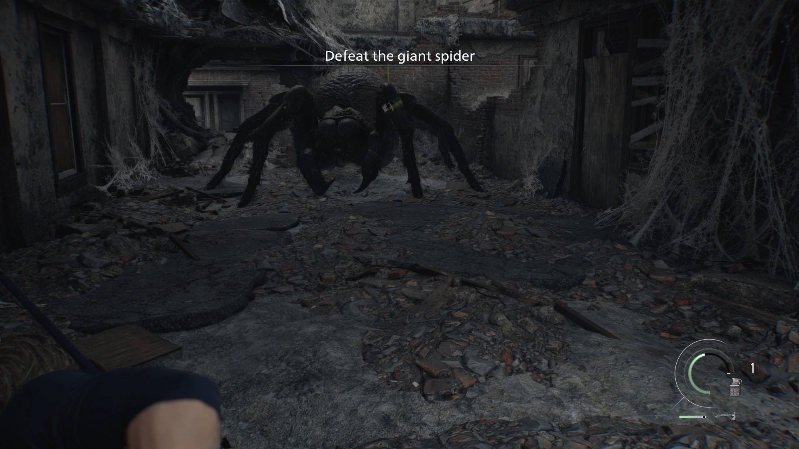||

I think Resident Evil Requiem is a must-play for all fans of horror and action. I'm really excited to discover what
places and characters CAPCOM will visit in the 10th entry to the series. Unless they somehow bring back Ethan Winters
for his third game, that is.